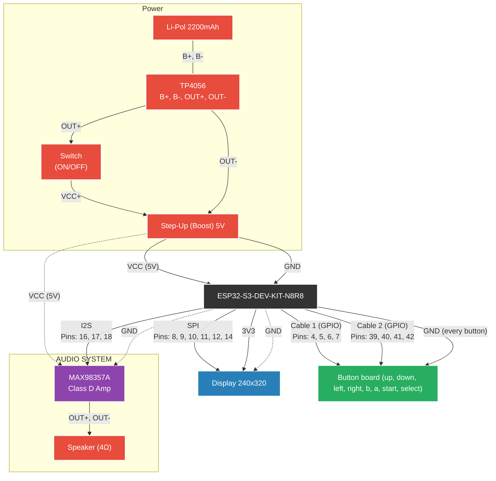

# ESP32-Handheld
A Handheld Game Console powered by ESP32

## Components diagram

```mermaid
graph TD
    ESP["ESP32-S3-DEV-KIT-N8R8"]

    subgraph PowerSystem ["Power"]
        BAT["Li-Pol 2200mAh"]
        TP4056["TP4056 <br> B+, B-, OUT+, OUT-"]
        SWITCH["Switch <br> (ON/OFF)"]
        STEPUP["Step-Up (Boost) 5V"]
    end

    BAT -- "B+, B-" --- TP4056
    TP4056 -- "OUT+" --> SWITCH
    SWITCH -- "VCC+" --> STEPUP
    TP4056 -- "OUT-" --> STEPUP
    STEPUP -- "VCC (5V)" --> ESP
    STEPUP -- "GND" --> ESP

    subgraph AudioSystem ["AUDIO SYSTEM"]
        I2S_DAC_AMP["MAX98357A <br> Class D Amp"]
        SPEAKER["Speaker (4Ω)"]
    end

    STEPUP -. "VCC (5V)" .-> I2S_DAC_AMP
    ESP -- "I2S <br> Pins: 16, 17, 18" --> I2S_DAC_AMP
    ESP -. "GND" .-> I2S_DAC_AMP
    I2S_DAC_AMP -- "OUT+, OUT-" --> SPEAKER

    DISP["Display 240x320"]
    ESP -- "SPI <br> Pins: 8, 9, 10, 11, 12, 14" --> DISP
    ESP -- "3V3" --> DISP
    ESP -. "GND" .-> DISP

    BTN_BOARD["Button board (up, down, left, right, b, a, start, select)"]

    ESP -- "Cable 1 (GPIO) <br> Pins: 4, 5, 6, 7" --> BTN_BOARD
    ESP -- "Cable 2 (GPIO) <br> Pins: 39, 40, 41, 42" --> BTN_BOARD
    ESP -- "GND (every button)" --> BTN_BOARD
    classDef core fill:#333,stroke:#fff,stroke-width:2px,color:#fff;
    classDef display fill:#2980b9,stroke:#fff,stroke-width:1px,color:#fff;
    classDef audio fill:#8e44ad,stroke:#fff,stroke-width:1px,color:#fff;
    classDef input fill:#27ae60,stroke:#fff,stroke-width:1px,color:#fff;
    classDef finalComponent fill:#e74c3c,stroke:#fff,stroke-width:2px,color:#fff;

    class ESP core;
    class DISP display;
    class I2S_DAC_AMP audio;
    class BTN_BOARD input;
    class PowerSystem power;
    class SPEAKER,BAT,TP4056,STEPUP,SWITCH finalComponent;
```